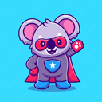

# super-uveg

<!-- LOGO PROYECTO -->
 

<h3 align="center">Super UVEG 🦸‍♂️🐨</h3>

  

    Super UVEG es la idea de crear un mejor campus virtual para todos, creado por estudiantes de la UVEG para estudiantes de la UVEG.
     
    <a href="#documentacion"><strong>Descargar »</strong></a>
     
     
    <a href="#para-empezar">Para empezar</a>
    ·
    <a href="#contribucion">Contribución</a>
    ·
  

 Basado en el template de <a target="_blank" href="https://github.com/narralabs/brackets">brackets</a> para el soporte de ES6 modules, gracias. 

